# LED Matrix Control 8x8

Educational embedded project developed for the Digital Circuit Design course.

The project implements a microcontroller system for controlling an 8x8 LED matrix with several display modes.

## Features
- Displaying group code symbols
- Moving light animation
- Custom square animation
- Mode switching
- Proteus simulation

## Technologies
- C
- AVR
- ISIS Proteus
- Digital circuit design

## Screenshots

1. Displaying the group code on the indicator using the dynamic method.

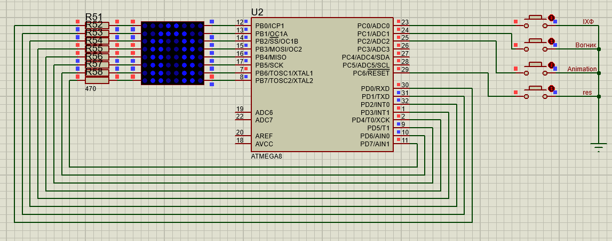
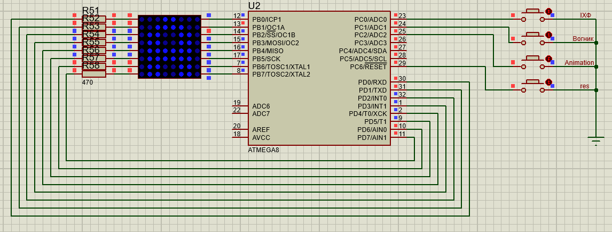
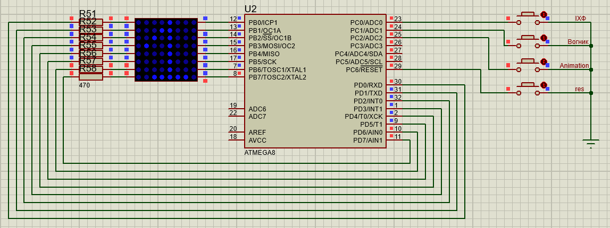

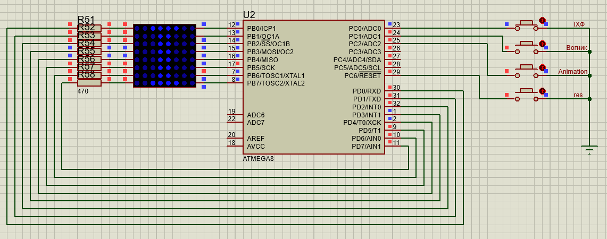
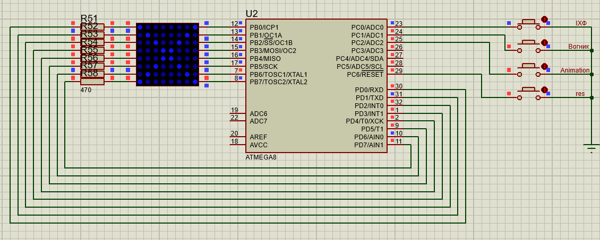
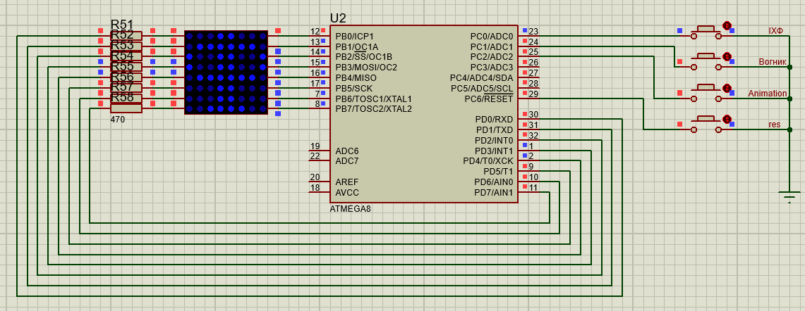

---

2. Displaying the “moving light” on the indicator using the static method according to the algorithm:

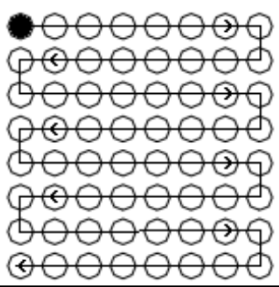
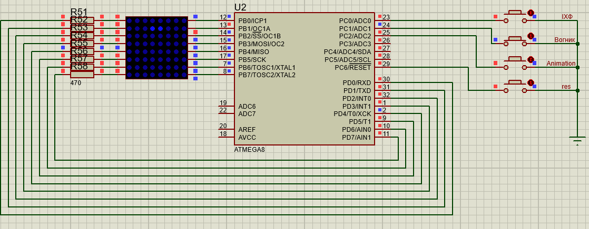

---
3. Implementing the original (third) mode of operation of the indicator, available in the system using the original mode switching method.

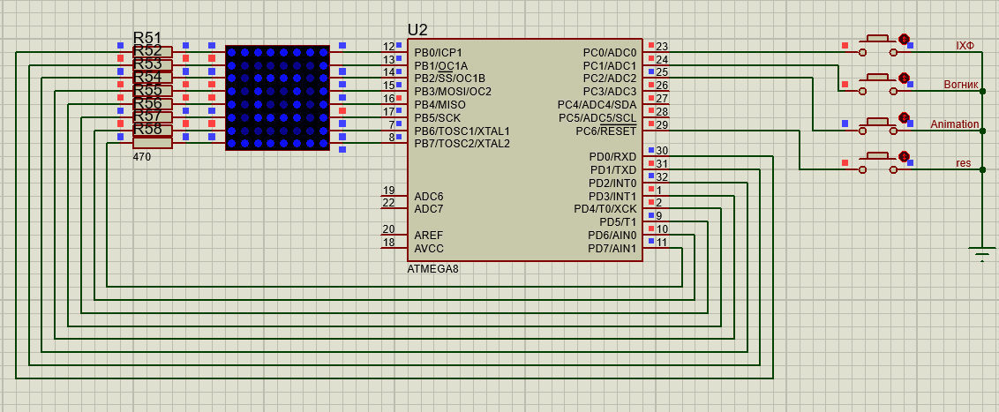
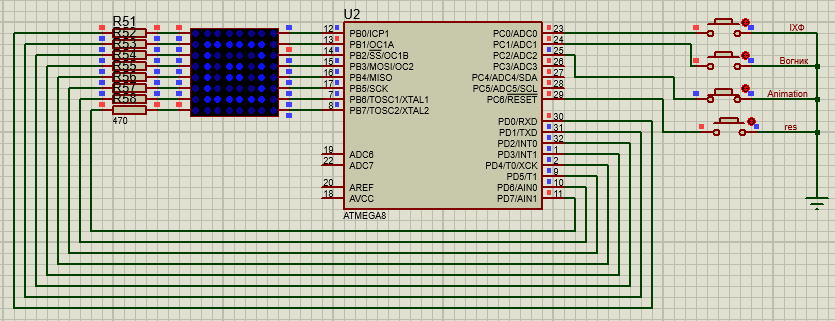

---

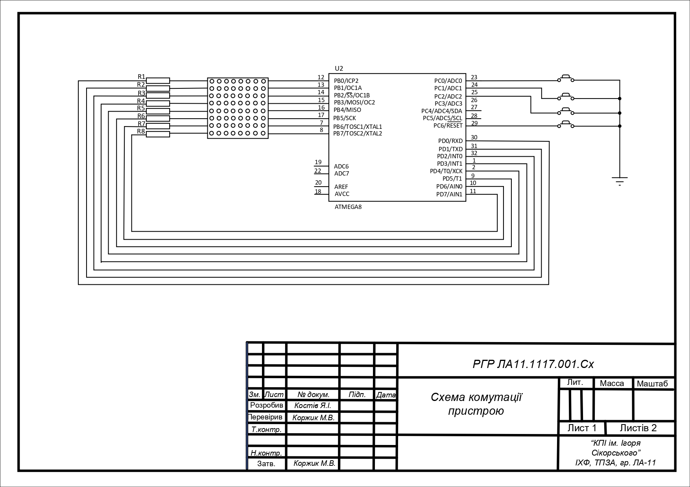
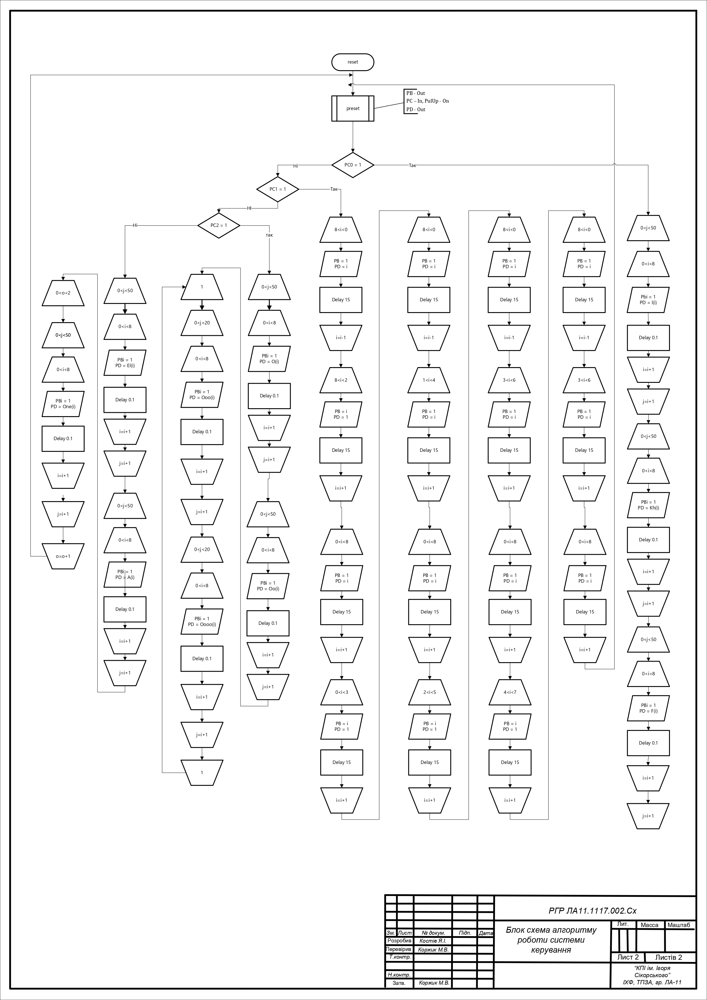

## Status
Educational archived project.
